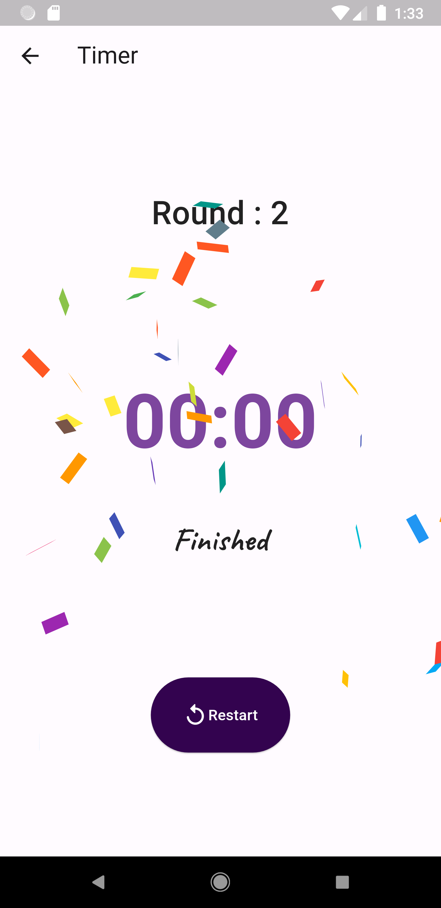
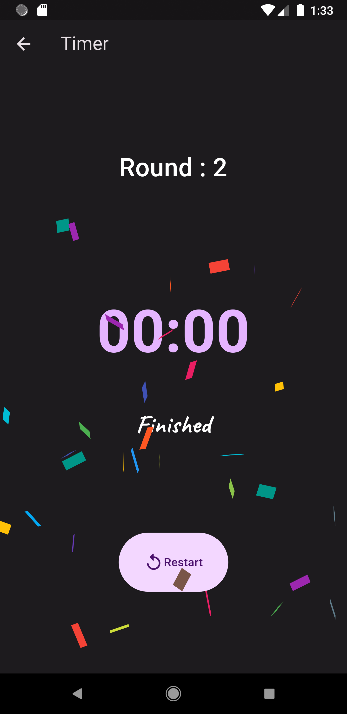

# Workout Timer with interval

## Getting Started
Flutter Framework was used to construct a simple Timer App project with Material 3 colours.
Basic timer features like Start, Stop, Pause, Resume, and Restart the timer are included in the app. It also includes a rest mode between intervals.

## Features
- Basic timer functionality (Eg. Start, Stop, Pause, Resume and Restart)
- Training with rest mode
- Quote while training
- Confetti Animation when finish training
- Use Material 3 design system

## Libraries & Tools Used
- [`confetti: ^0.7.0`](https://pub.dev/packages/confetti)
- [`flutter_touch_spin: ^2.0.0`](https://pub.dev/packages/flutter_touch_spin)
- [`google_fonts: ^3.0.1`](https://pub.dev/packages/google_fonts)
- [`http: ^0.13.4`](https://pub.dev/packages/http)
- [`numberpicker: ^2.1.1`](https://pub.dev/packages/numberpicker)
- [`wakelock: ^0.6.2`](https://pub.dev/packages/wakelock)

## Folder Structure
Here is the core folder structure which flutter provides.

```
flutter-app/
|- android
|- build
|- ios
|- lib
|- test
```

Here is the folder structure we have been using in this project

```
lib/
|- model/
|- screens/
|- widgets/
|- color_schemes.dart
|- main.dart
|- quotes.dart
```

Now, lets dive into the lib folder which has the main code for the application.

```
1- model - All the class model are defined in this directory with-in their respective files. This directory contains the constants for `Training`.
2- screens - Contains the UI/page of this project, contains sub directory for each screen.
3- widgets - Contains custom widgets of this project, includes widgets custom_button and duration_picker.
4- color_schemes.dart — Contains the dark and light theme data of this application.
5- main.dart - This is the starting point of the application. All the application level configurations are defined in this file i.e, theme, page, title etc.
6- qoutes.dart — This file contains future function to fetch quotes from API.
```

### Model

This directory contains all the application class model. A separate file is created for each type as shown in example below:

```
model/
|- training_model.dart
```

### Screens

This file contains all the pages for this application.

```
screens/
|- home_page.dart
|- timer_page.dart
```

### Widgets

Contains the common widgets that are shared across multiple screens. For example, Button, Picker etc.

```
widgets/
|- custom_button.dart
|- duration_picker.dart
```

## Screenshots
### Home Page
| Light Mode | Dark Mode |
| ---------------- | ---------------- |
|  |  |

### Duration Picker
| Light Mode | Dark Mode |
| ---------------- | ---------------- |
|  |  |

### Timer Page
| Light Mode | Dark Mode |
| ---------------- | ---------------- |
|  |  |

### Rest View
| Light Mode | Dark Mode |
| ---------------- | ---------------- |
|  |  |

### Finish View
| Light Mode | Dark Mode |
| ---------------- | ---------------- |
|  |  |
