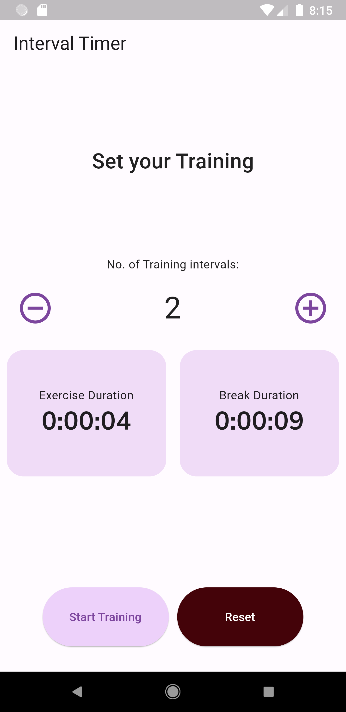
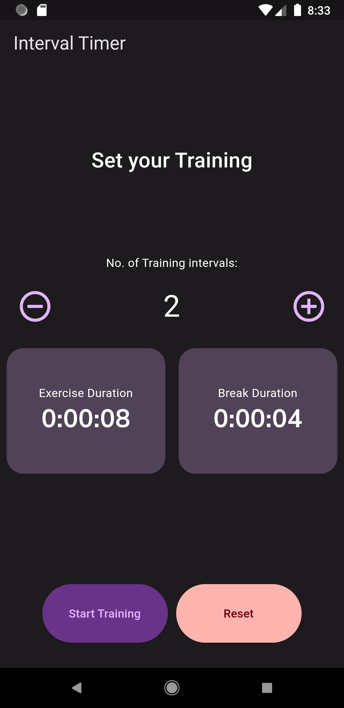
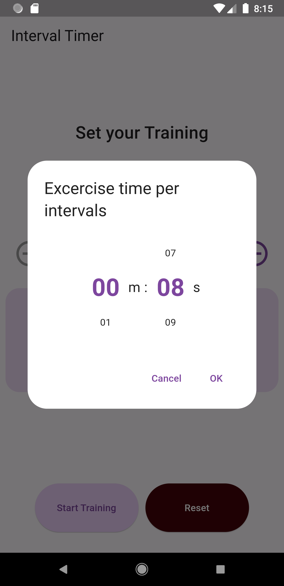
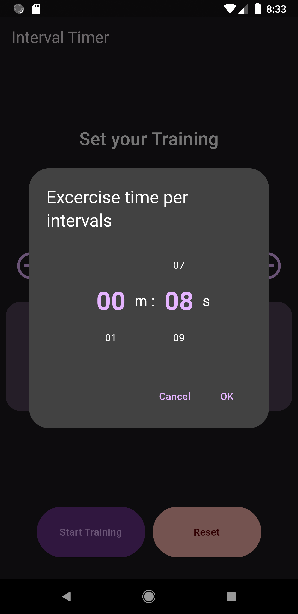
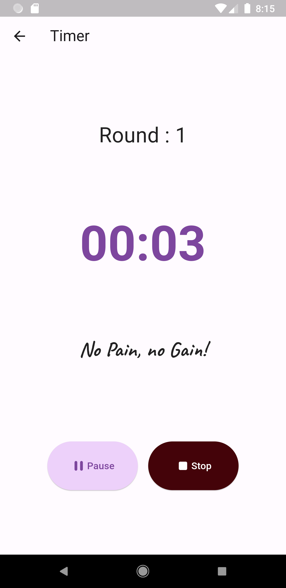
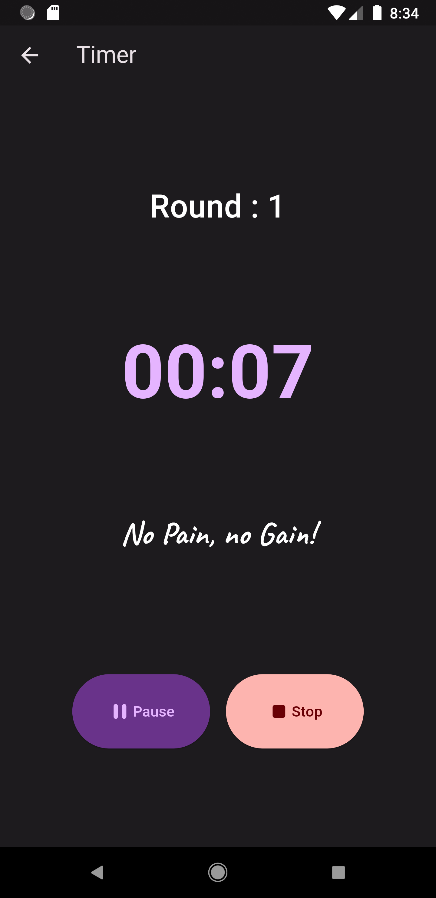
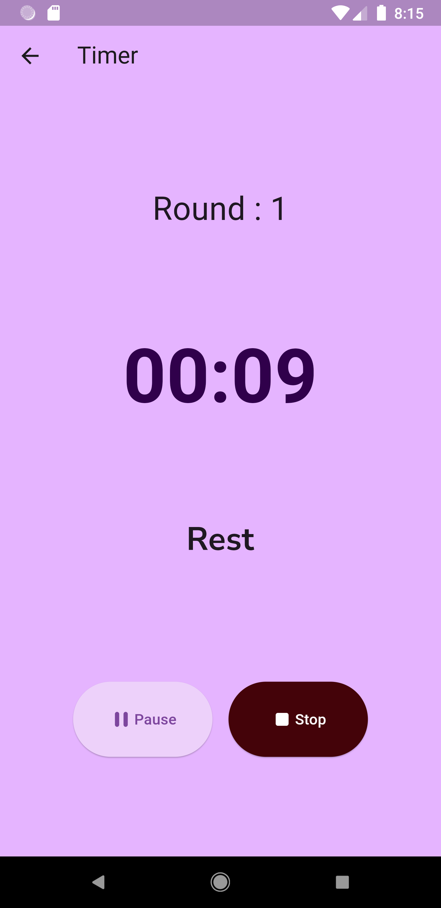
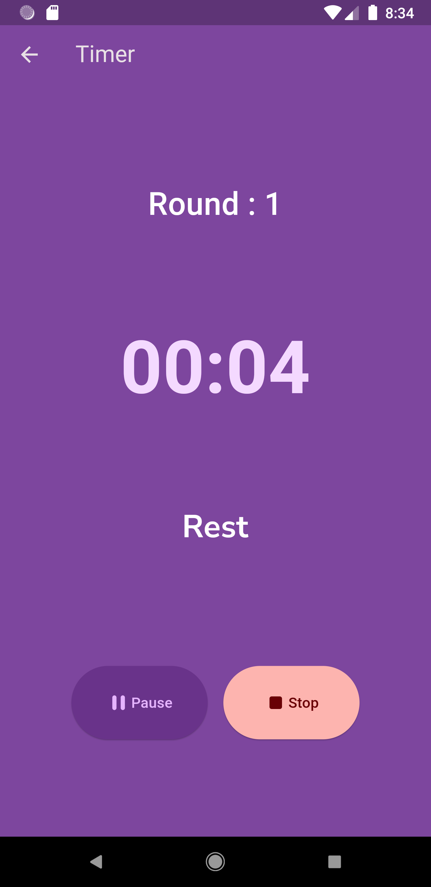
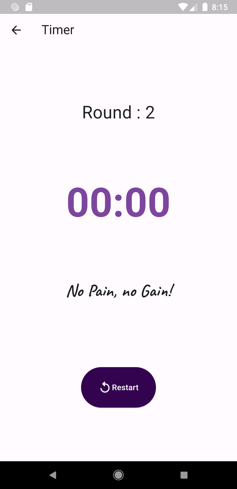
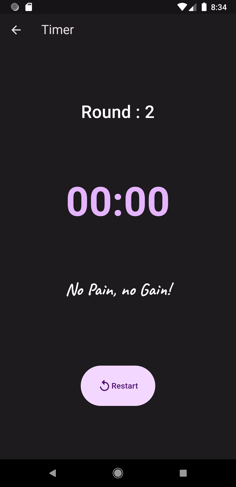

# Workout Timer with interval

A basic Timer App project with Material 3 color created using Futter Framework.

## Screenshots
### Home Page
| Light Mode | Dark Mode |
| ---------------- | ---------------- |
|  |  |

## Duration Picker
| Light Mode | Dark Mode |
| ---------------- | ---------------- |
|  |  |

## Timer Page
| Light Mode | Dark Mode |
| ---------------- | ---------------- |
|  |  |

## Rest View
| Light Mode | Dark Mode |
| ---------------- | ---------------- |
|  |  |

## Finish View
| Light Mode | Dark Mode |
| ---------------- | ---------------- |
|  |  |
